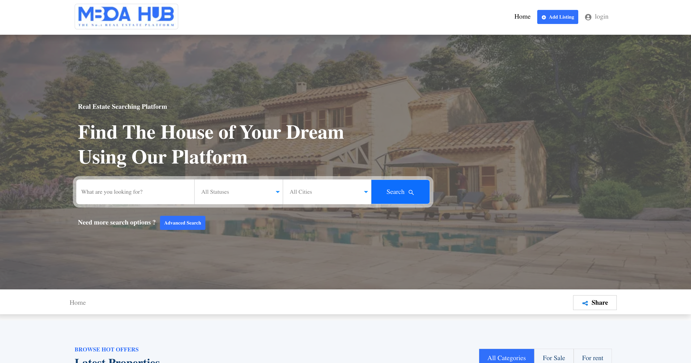

# Mboahub Frontend - Real Estate Marketplace



Mboahub is a cutting-edge Real Estate Marketplace built with React.js, utilizing modern technologies such as hooks, context API, and fetch to interact with the backend API. The application aims to provide an intuitive and seamless experience for users looking to buy, sell, or rent properties.

## Table of Contents

- [Features](#features)
- [Installation](#installation)
- [Technologies Used](#technologies-used)
- [Getting Started](#getting-started)
- [API Integration](#api-integration)
- [Contributing](#contributing)
- [License](#license)

## Features

- User-friendly interface for easy property search and listing
- Advanced search filters to refine property searches
- Secure user authentication and authorization
- Interactive property details with images, descriptions, and amenities
- Property favoriting and bookmarking
- Real-time notifications for new properties and updates
- Responsive design for seamless usage on various devices
- Efficient state management using React hooks and context API

## Installation

Before running the application, make sure you have Node.js and npm installed on your system.

1. Clone the repository:

```bash
git clone https://github.com/ngodi/mboahub_reactjs.git
cd mboahub_reactjs
```

2. Install dependencies:

```bash
npm install
```

3. Configure the backend API URL:

   Open the `.env` file and replace the value of `REACT_APP_BACKEND_API_URL` with the URL of the backend API.

4. Run the development server:

```bash
npm start
```

Visit `http://localhost:3000` in your browser to access the application.

## Technologies Used

- React.js: Frontend JavaScript library for building user interfaces
- React Hooks: To add state and lifecycle features to functional components
- React Context API: For global state management across components
- Fetch API: For making HTTP requests to the backend API
- Bootstrap: For responsive and modern UI components
- React Router: For handling navigation and routing

## Getting Started

Follow these steps to get started with contributing or using the Mboahub Frontend:

1. **Fork** the repository from the official Mboahub Frontend repository on GitHub.
2. **Clone** your forked repository to your local development environment.
3. Create a new branch for your feature or bug fix:
   ```bash
   git checkout -b feature/new-feature
   ```
4. Implement your changes and **commit** them with descriptive commit messages.
5. **Push** your changes to your forked repository on GitHub:
   ```bash
   git push origin feature/new-feature
   ```
6. Open a **pull request** in the official Mboahub Frontend repository and describe your changes.

## API Integration

The Mboahub Frontend interacts with the Mboahub Backend API to fetch property data, user information, and other relevant data. The backend API should be up and running for the frontend to function correctly.

Please refer to the [Mboahub Backend API documentation](https://api.mboahub.com/docs) for details on how to set up and use the API.

## Contributing

We welcome contributions from the community to enhance Mboahub Frontend. To contribute, follow the steps mentioned in the [Getting Started](#getting-started) section. Be sure to read our [Contribution Guidelines](CONTRIBUTING.md) before submitting a pull request.

## License

Mboahub Frontend is distributed under the [MIT License](LICENSE).

For any questions or issues, please contact the Mboahub team at albertngodi@gmail.com. Happy coding!
